# Ravn React Code Challenge

[](https://github.com/DGVIP/ravn-react-code-challenge/actions/workflows/pipeline.yml)

## Table of Contents

1. [Description](#description)

2. [Setup/Running instructions](#setuprunning-instructions)

3. [Project Structure](#development-process)

4. [Technologies](#technologies)

5. [Development Process](#development-process)

6. [TODO](#todo-list)

## Description

The present Task Management App is a collaboration tool based on kanban that allows to organize projects into boards delegating responsibilites and establishing deadlines for each. There, multiple users in a same team can interact with it to create, check, update or delete the tasks assigned for the project.

## Setup/Running instructions

Once the repository is cloned, to install the dependencies, run the following command:

```bash
$ yarn install
```

Create a new .env file and add the variables specified in the .env.example file or set the environment variables manually.

Then, you can run the following command to start the development server:

```bash
$ yarn run dev
```

There, you can see the application running on the localhost:3000.

To run the project as if it were a production environment, first run the following command:

```bash
$ yarn run build
```

Then, you can run the following command to start the production server:

```bash
$ yarn run preview
```

You can also try the [live demo](https://ravn-react-code-challenge.vercel.app/) hosted on Vercel.

## Project Structure

```
project/
├── .github/
│   └── workflows/   # Scripts for gh-actions
├── .husky/          # Git hooks configuration (ex: pre-commit).
├── src/
│   ├── app/         # App component
│   ├── configs/     # Configuration files
│   ├── contexts/    # Global state management
│   ├── graphql/     # GraphQL queries and mutations
│   ├── hooks/       # Custom hooks
│   ├── images/
│   ├── navigation/  # Routing configuration
│   ├── pages/       # views with its scoped components
│   ├── shared/      # Layout and shared components
│   │   └── common/  # Reusable components
│   ├── types/       # Global types and Definitions
│   ├── utils/       # Utility reusable functions
│   └── main.tsx     # Main entry point
└── .env.example     # Environment variables example
```

Example Component Structure:

```
scope/                  # Scope of the component
└── Component/          # PascalCase container directory
    ├── SubComponent/   # Scoped Component
    │   └── ...         # repeat structure
    ├── index.tsx       # Component definition
    ├── styles.tsx      # Styled components
    ├── tests.ts        # Component unit tests
    └── types.ts        # Scoped type definitions
```

## Technologies

-  **Styles:** Styled Components

   -  I decided to use this approach for styling because this way it is easier to separate the styling from the semantic markup, making the components easier to read and understand.

-  **Vite:** Tool for bundling the project

   -  I used this instead of the most common create-react-app because it is several times faster either at startup or while hot-reloading.

-  **Typescript:** superset of Javascript that allows to write code in a more readable way and to use type-checking

-  **Prettier:** Code formatter

   -  I used this to format the code before committing to the repository.

-  **ESLint (Standard):** Linter

   -  It is used to check the code for errors and to prevent them from being committed to the repository.

-  **lint-staged:** used to lint the code before committing

-  **Apollo Client:** GraphQL client

   -  It is used to connect the app to the GraphQL server.

-  **Framer Motion:** used to make complex animations

-  **React Icons:** used to create the Remix icons

-  **React Hook Form:** used to manage the forms integrate with the validation library without handling a complex state.

-  **Yup:** used to validate the form

-  **React Beautiful DnD:** used to make the drag and drop of the task cards

-  **React toastify:** used to show the notifications on success or error of the actions

-  **GrahpQL CodeGen:** used to retrieve the most updated schema from the server and generate hooks using Apollo Client based on the GraphQL queries and mutations defined.

## Development Process

First, I created the project with vite, then, added eslint standard, prettier, and lint-staged (Husky) for the git hooks.

After installing the neccesary dependencies for the base prototype (react-router-dom, styled-components, framer-motion, react-icons), I created the project structure and created the dashboard interface without functionality.

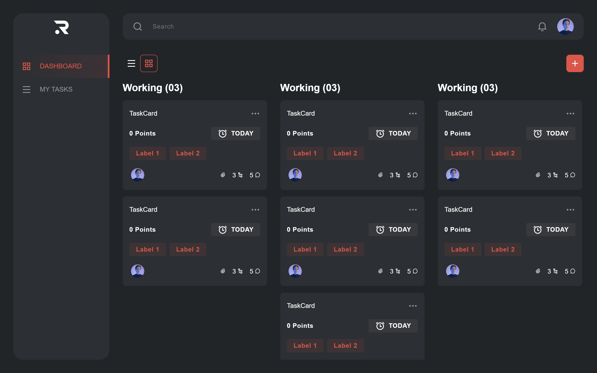

Then, I added the libraries neccesary for fetching the data from the GraphQL server (@apollo/client, graphql-codegen) and fetched the tasks from the server. Also, I added loading, error, and empty pages fot the tasks.

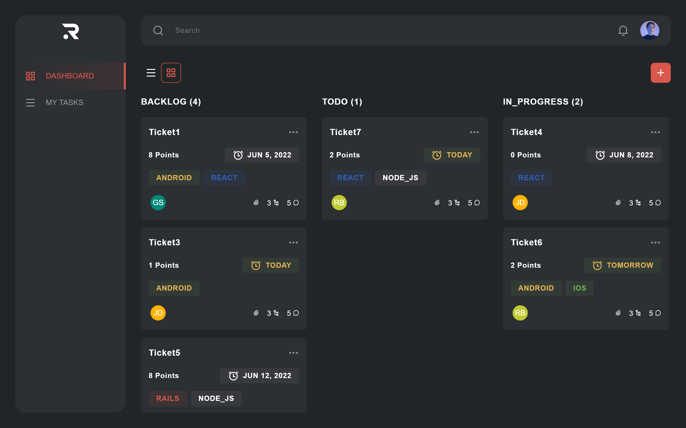
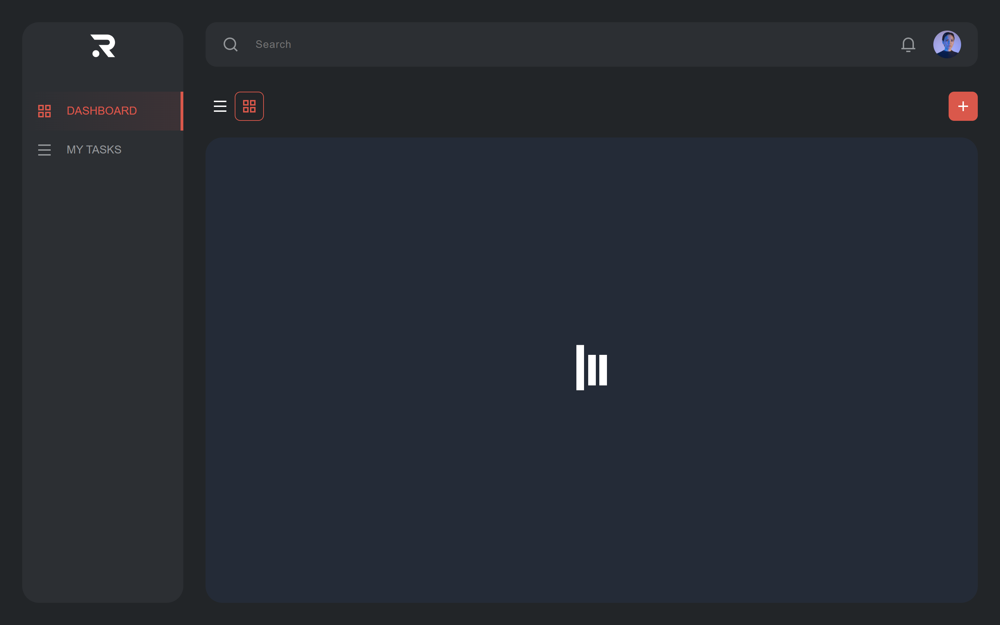
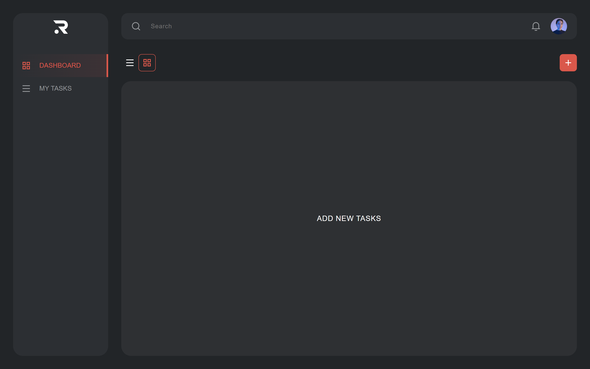
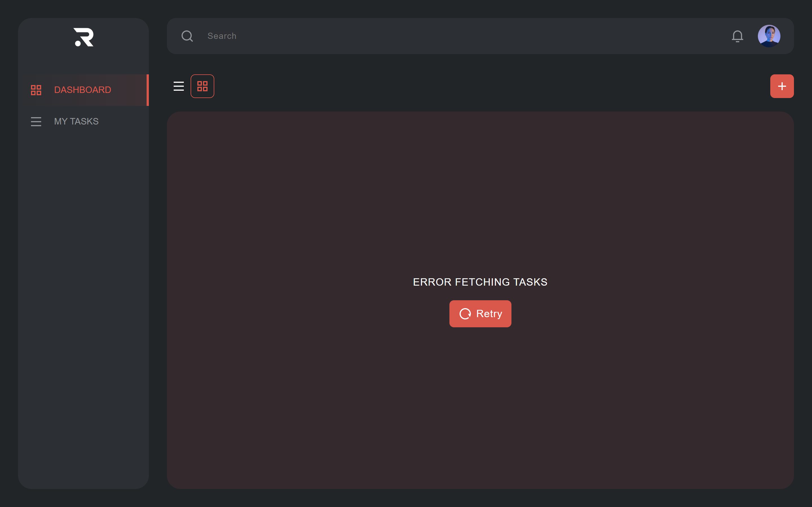

Once the tasks could be fetched, I started working on the create task functionality.

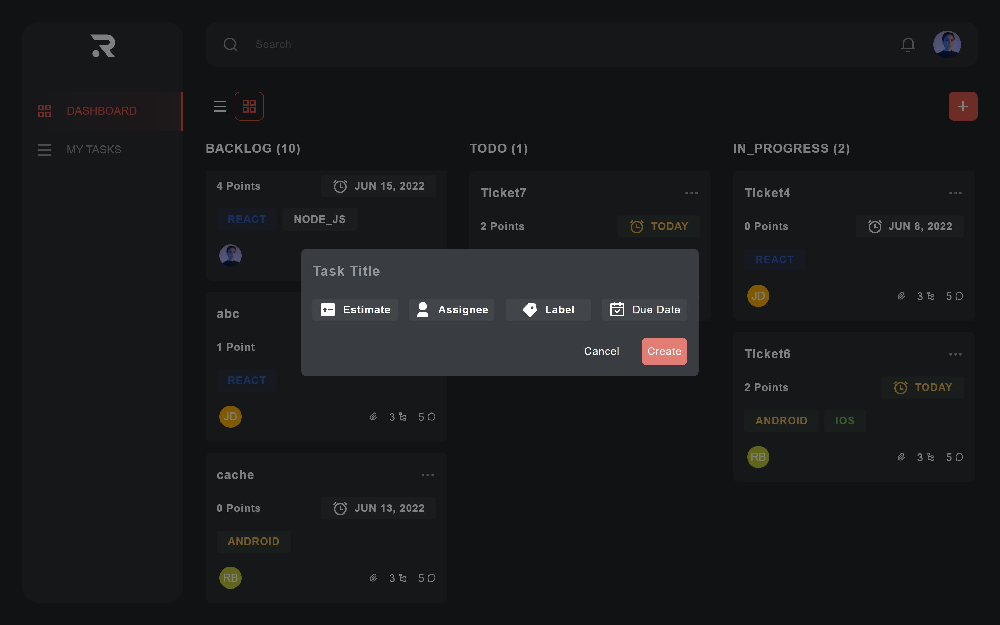
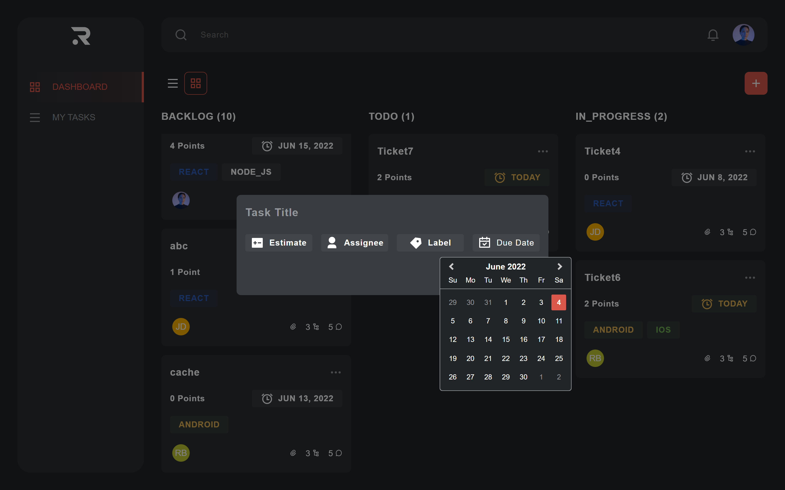
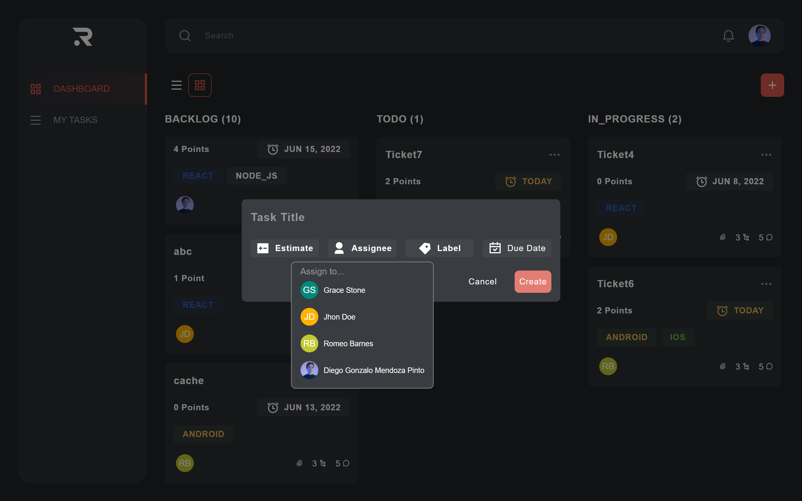

Then, I added the functionality to update and delete a task, and added **cache modifying** and **optimistic responses** to make the app more reactive.

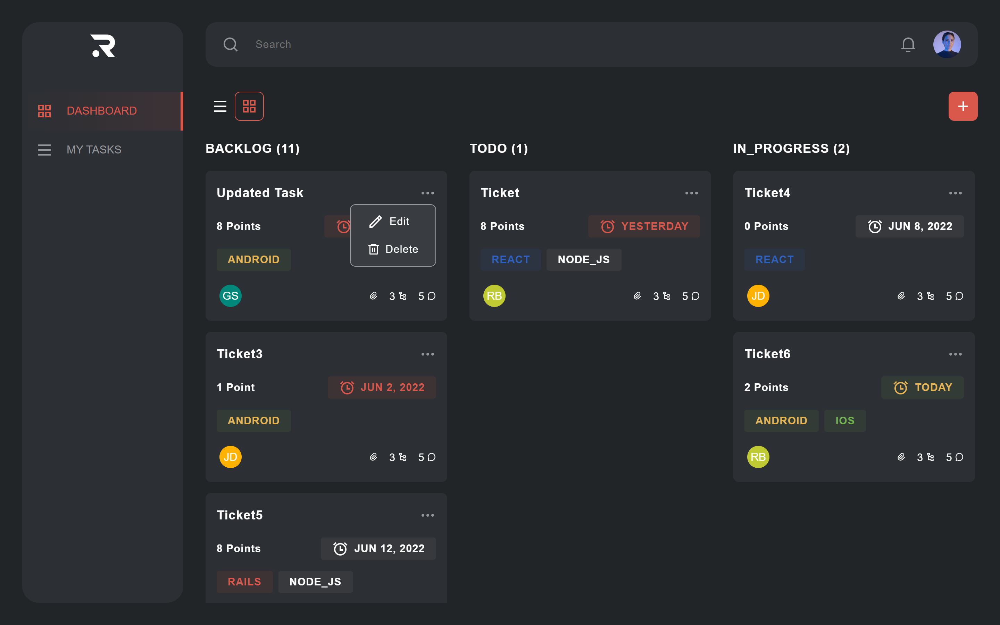
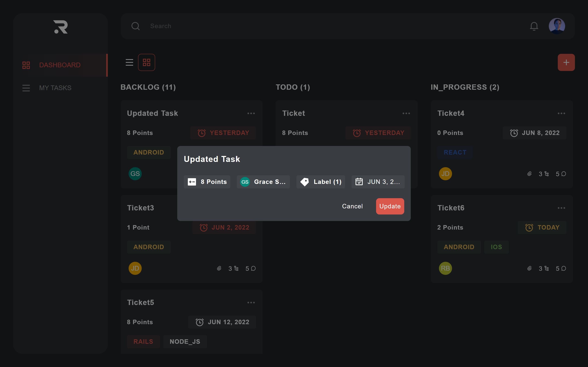
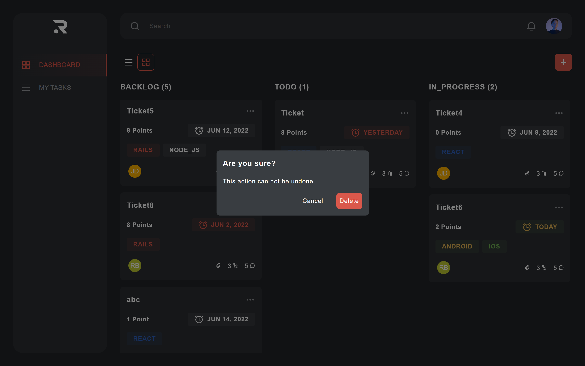

Finally I created the table view of the tasks, and added a new view called Settings to display the user profile.

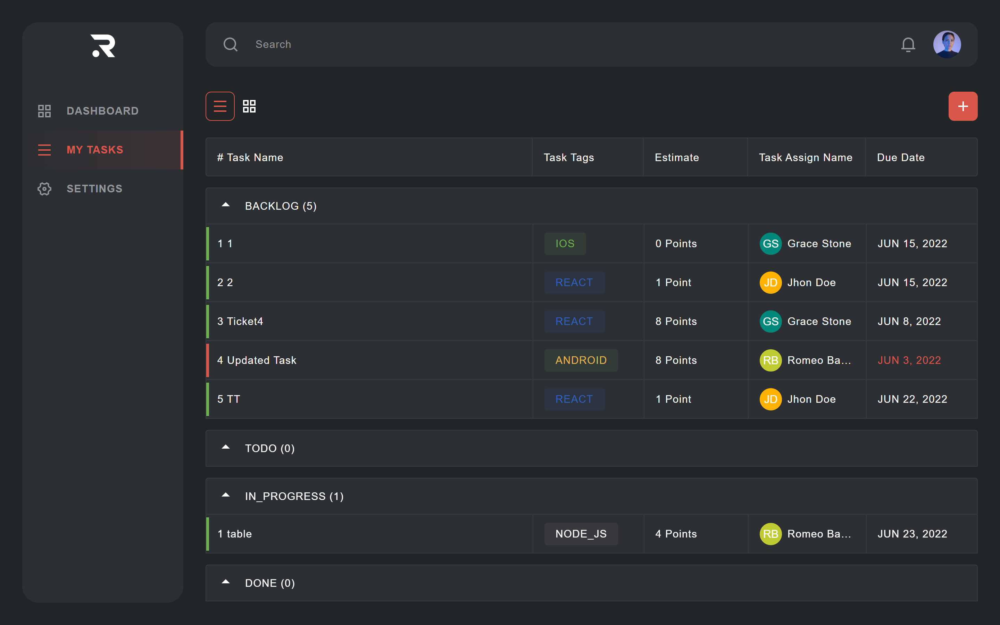
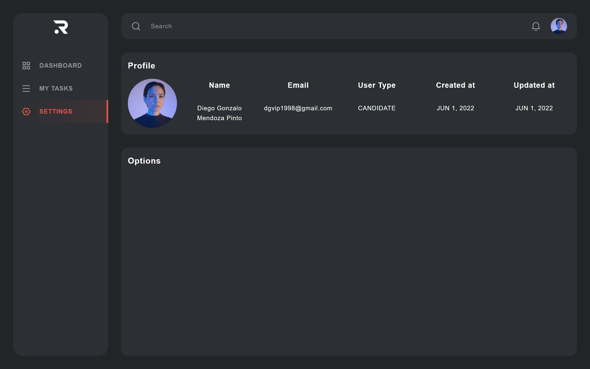

For the quality assurance aspect of the project, I created a simple **Github Actions** workflow to lint the code and deploy it to Vercel. The workflow is configured to run every time a commit or a pull request is made. There is still pending to configure the workflow to run the unit and end-to-end tests.

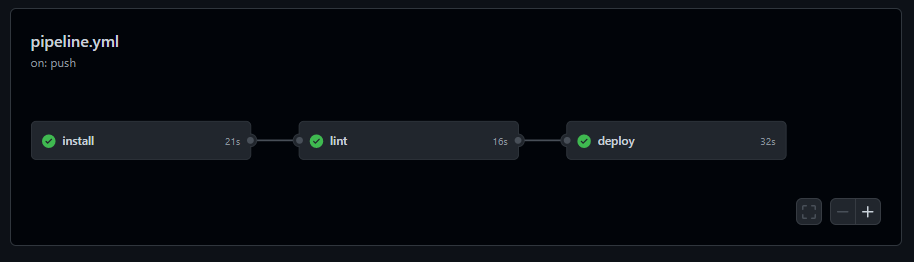

## Todo List

-  Add tests

-  Add filter tasks functionality

-  Improve drag & drop task cards behavior

-  Abstract more components like the Button

-  Add aliases for the project main folders to reduce import statements

-  Refactor the code to adjust to the final project requirements
